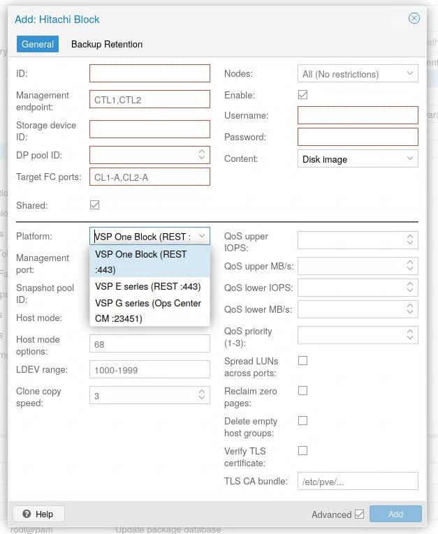
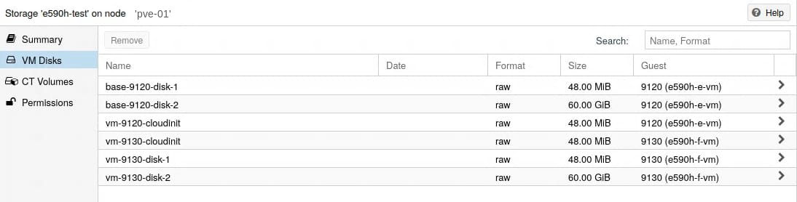

# PVE Hitachi Block Storage Plugin

A [Proxmox VE](https://www.proxmox.com/) storage plugin for Hitachi Fibre Channel
block storage (VSP One Block, VSP E series, and VSP G series). It provisions
**one LUN per virtual disk** and offloads storage services — snapshots, clones,
thin provisioning, QoS, replication — to the array.

[](https://build.opensuse.org/package/show/home:ciriarte:pve-HitachiBlockPlugin/pve-storage-hitachiblock)

> ### ⚠️ Project status: pre-production, not yet hardware-validated
>
> This plugin was developed against the Hitachi Configuration Manager REST API
> **specification and documentation**, and its logic is covered by an automated unit
> test suite — but **it has not yet been validated against a live array or a real
> Proxmox cluster.** The unit tests mock the array, the REST client, and the
> multipath/sysfs layer, so they cannot prove that provisioning, mapping, snapshots,
> or clones behave correctly on actual hardware.
>
> **Do not use it against production data or a production cluster yet.** Treat it as
> alpha. Before relying on it, work through
> [`docs/INTEGRATION_CHECKLIST.md`](docs/INTEGRATION_CHECKLIST.md) on your own array
> (lab/test first) — it lists every assumption the code makes, how to verify each on
> hardware, and what to change if it is wrong. Operations that create or delete LDEVs,
> map LUNs, or snapshot/clone volumes can affect or destroy data if an assumption is
> wrong on your model/microcode.
>
> Issue reports, and especially hardware-validation results, are very welcome — see
> [Contributing](#contributing).

> ### 🧭 Roadmap: a multi-vendor framework
>
> Once this plugin is **stable and hardware-validated**, its design is intended to be
> refactored into a vendor-neutral Fibre Channel storage framework —
> [**pve-FCLUPlugin**](https://github.com/ciroiriarte/pve-FCLUPlugin) — that
> generalizes the array Driver / host Connector / shared Plugin-Registry-Capabilities
> spine so the same per-virtual-disk LUN model can drive other arrays (e.g. Dell
> PowerMax/PowerStore, Pure Storage, IBM FlashSystem, NetApp). This plugin serves as
> the reference implementation; the migration is staged, so it remains the supported
> path until the framework is ready.

## Features

- **1 LUN per virtual disk** — direct array volumes, no LVM layer.
- **Thin provisioning** via Hitachi Dynamic Provisioning (DP) pools.
- **Snapshots** — array-offloaded Thin Image, per LDEV, with metadata tracked in a
  cluster-replicated registry.
- **Copy-on-write linked clones** — space-efficient Thin Image clones from a base
  image or a snapshot; full copies are handled by Proxmox via the device path.
- **Online volume resize** — array expand + host-side multipath resize.
- **QoS** — per-LDEV upper/lower IOPS and throughput limits and I/O priority.
- **Multipath-aware** — FC WWN discovery, ALUA device stanza, automatic WWID
  whitelisting (`find_multipaths strict`), and authoritative WWID from the array.
- **Active-node-only LUN mapping** — keeps per-host LUN counts low; live migration
  remaps on the fly.
- **Management-plane controller redundancy** — `mgmt_ip` accepts multiple
  per-controller endpoints with automatic failover and re-authentication.
- **Storage migration** — Move Storage to/from file stores (hot/cold), plus
  `volume_export`/`volume_import` for offline cross-node / `pvesm` migration.
- **Disk reassignment** (`rename_volume`), **base/template images**, **orphan
  detection**, and **partial-failure rollback** during provisioning.
- **Replication CLI** (`hitachiblock-repl`) for TrueCopy, Universal Replicator, and
  Global-Active Device (GAD).

See [Operations](docs/operations.md) for how each is used.

## Screenshots

Add the storage from *Datacenter → Storage → Add → Hitachi Block* — the platform
drop-down picks the REST dialect (VSP One Block / E series / G series):



Each virtual disk is a dedicated array LDEV, browsable under the node's storage view:



More in [Installation § Creating the Storage](docs/installation.md#creating-the-storage)
and [Operations](docs/operations.md).

## Supported platforms

| Platform | `platform` | API endpoint | Default port |
|----------|------------|--------------|--------------|
| VSP One Block | `vsp_one` | Built-in REST API on the controller | 443 |
| VSP E series (e.g. E590H) | `vsp_e` | Embedded Configuration Manager REST API on the GUM | 443 |
| VSP G series | `vsp_g` | Ops Center API Configuration Manager server | 23451 |

All platforms speak the standard Configuration Manager REST API object model
(`/ConfigurationManager/v1/objects/storages/<storageDeviceId>/…`). The only
difference is the management endpoint (IP + port). See
[Configuration § Platform Differences](docs/configuration.md#platform-differences).

## Requirements

- A Proxmox VE node/cluster with Fibre Channel HBAs and `multipath-tools`.
- A Hitachi VSP array reachable over the Configuration Manager REST API, with a DP
  pool, FC target ports, and an API user.
- FC zoning between the hosts and the array.

Full host- and array-side prerequisites:
[Installation](docs/installation.md) · [Storage Appliance Prerequisites](docs/prerequisites.md).

## Quick start

Install from the [OBS](https://build.opensuse.org/package/show/home:ciriarte:pve-HitachiBlockPlugin/pve-storage-hitachiblock)
repository on each PVE 9 node (Debian 13 / Trixie base):

```bash
echo 'deb http://download.opensuse.org/repositories/home:/ciriarte:/pve-HitachiBlockPlugin/PVE_9/ /' \
  > /etc/apt/sources.list.d/hitachiblock.list
curl -fsSL 'https://download.opensuse.org/repositories/home:/ciriarte:/pve-HitachiBlockPlugin/PVE_9/Release.key' \
  | gpg --dearmor > /etc/apt/trusted.gpg.d/home_ciriarte_hitachiblock.gpg
apt update && apt install pve-storage-hitachiblock
systemctl restart pvedaemon
```

> The repository is named `PVE_9` after the Proxmox release (not the Debian base).
> It currently ships an **alpha** build — see the status note above and
> [`docs/packaging-obs.md`](docs/packaging-obs.md) for packaging details.

Or build and install from source on each node:

```bash
make install          # or: make deb && dpkg -i ../pve-storage-hitachiblock_*_all.deb
systemctl restart pvedaemon
```

Add the storage to `/etc/pve/storage.cfg`:

```
hitachiblock: myarray
    mgmt_ip 10.0.1.100
    storage_id 836000123456
    pool_id 0
    snap_pool_id 1
    target_ports CL1-A,CL2-A
    host_mode LINUX/IRIX
    platform vsp_one
    shared 1
    content images
    nodes node1,node2,node3
```

Store the API credentials (kept out of `storage.cfg`, in cluster-replicated
`/etc/pve/priv`):

```bash
pvesm set myarray --username admin --password secret
```

See [Configuration](docs/configuration.md) for every parameter, multi-controller
endpoints, TLS, and QoS, and [`conf/storage.cfg.example`](conf/storage.cfg.example)
for per-platform examples.

## Documentation

- **[Documentation index](docs/README.md)** — start here.
- [Architecture](docs/architecture.md) — components, modules, data flows.
- [Installation](docs/installation.md) — host prerequisites, install, multipath.
- [Configuration](docs/configuration.md) — every parameter, credentials, redundancy.
- [Operations](docs/operations.md) — storage services, replication CLI, migration, troubleshooting.
- [Storage Appliance Prerequisites](docs/prerequisites.md) — what to configure on the array.
- [Hardware Integration Checklist](docs/INTEGRATION_CHECKLIST.md) — **read before trusting it** on hardware.
- [Vendor reference extracts](docs/reference/) — distilled Hitachi REST API / user-guide notes.

## Testing

```bash
make test    # Perl unit tests (logic + PVE contracts; the array is mocked)
```

The unit suite does **not** touch hardware. Real validation follows the
[Test Plan](docs/test-plan.md) and the
[Hardware Integration Checklist](docs/INTEGRATION_CHECKLIST.md); record results under
`t/integration/`.

## Contributing

Contributions and hardware-validation reports are welcome — see
[CONTRIBUTING.md](CONTRIBUTING.md). To report a security-relevant issue, see
[SECURITY.md](SECURITY.md).

## Provenance

This project's content is generated through AI prompting (Claude), directed and
reviewed by the maintainer, who is responsible for all content. Commits carry a
`Generated-By:` trailer to reflect this.

## License

[AGPL-3.0](LICENSE) — © Ciro Iriarte and contributors.
