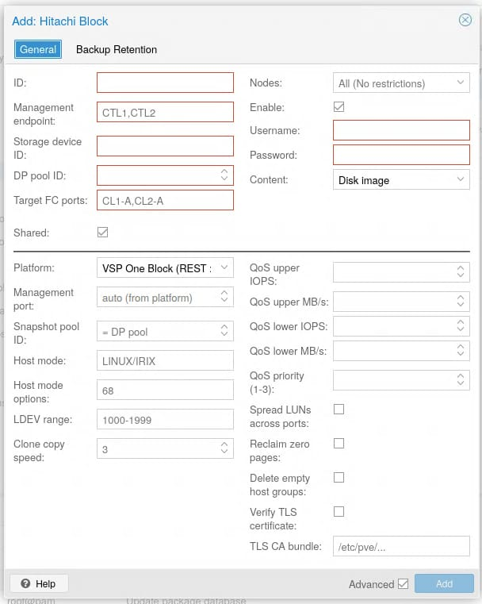
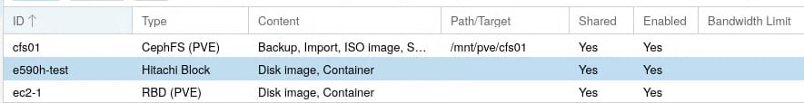

# Installation

## PVE Host Prerequisites

### Proxmox VE

- Proxmox VE 8.0 or later

### Fibre Channel

- FC HBA installed in each PVE cluster node
- FC link must be online:
  ```bash
  cat /sys/class/fc_host/host*/port_state
  # Expected: Online
  ```

### Multipath

Install and configure `multipath-tools`:

```bash
apt-get install multipath-tools
systemctl enable multipathd
systemctl start multipathd
```

### Perl Dependencies

The following Perl modules are required (typically pre-installed on PVE):

- `LWP::UserAgent` (libwww-perl)
- `JSON` (libjson-perl)
- `IO::Socket::SSL` (libio-socket-ssl-perl)
- `Getopt::Long` (core module)

Install any missing dependencies:

```bash
apt-get install libwww-perl libjson-perl libio-socket-ssl-perl
```

### SCSI-3 Persistent Reservations (optional)

Required only when using clustered shared disks (Windows Failover Clustering, OCFS2,
GFS2, Oracle RAC). Enable the QEMU PR helper socket on each node that will run
clustered guests:

```bash
systemctl enable --now qemu-pr-helper.socket
```

A per-node `reservation_key` in `multipath.conf` is also required so the reservation
survives path failover — see [Clustered Shared Disks](clustered-disks.md) for the
full setup procedure and `multipath.conf` examples.

---

### SAN Zoning

Fibre Channel zoning must be configured between:
- PVE node FC HBA ports (initiator WWNs)
- Hitachi storage target FC ports

See [Storage Appliance Prerequisites](prerequisites.md) for details.

---

## Storage Appliance Prerequisites

See [prerequisites.md](prerequisites.md) for the complete list of what must be configured on the Hitachi array before installing the plugin:

- Configuration Manager REST API enabled/installed
- API user account with appropriate roles
- DP pools created
- FC target ports configured
- SAN zoning
- Licenses (Dynamic Provisioning, Thin Image, etc.)

---

> **Install the plugin on *every* node of the cluster — including nodes without
> FC/SAN connectivity.** `storage.cfg` is cluster-wide (replicated by pmxcfs), so
> every node's `pvedaemon`/`pvestatd` parses it. A node that is missing the
> `HitachiBlockPlugin.pm` module cannot resolve the `hitachiblock` type and will
> **silently drop the storage from its web UI and `pvesm status`** — producing the
> inconsistent rendering described in GitHub issue #5. Restrict *activation* to
> SAN-connected nodes with the `nodes=` storage option (see
> [configuration.md](configuration.md)); nodes outside that list still display the
> storage (as disabled) but never try to reach the array.

## Install from Source

```bash
cd pve-HitachiBlockPlugin
sudo make install
sudo systemctl restart pvedaemon pvestatd
# reload the browser (Ctrl-Shift-R) to pick up the web UI module
```

This installs:
- Plugin module: `/usr/share/perl5/PVE/Storage/Custom/HitachiBlockPlugin.pm`
- Helper modules: `/usr/share/perl5/PVE/Storage/HitachiBlock/{RestClient,Multipath,Config}.pm`
- Replication CLI: `/usr/bin/hitachiblock-repl`
- Web UI module: `/usr/share/pve-manager/js/pve-storage-hitachiblock.js` (and a
  `<script>` include added to `/usr/share/pve-manager/index.html.tpl`)
- Example configs: `/usr/share/doc/pve-storage-hitachiblock/`

## Install from Debian Package

```bash
make deb
# the .deb is named for the version in version.mk, e.g. pve-storage-hitachiblock_1.2.0-1_all.deb
sudo dpkg -i ../pve-storage-hitachiblock_*_all.deb
sudo systemctl restart pvedaemon pvestatd
```

The `.deb` wires the web UI module into `index.html.tpl` through a dpkg **trigger**,
so the integration is re-applied automatically whenever `pve-manager` is upgraded
(which rewrites that template). Reload the browser (Ctrl-Shift-R) after install.

## Multipath Configuration

Install `multipath-tools` on every node and copy the recommended device settings
for Hitachi VSP:

```bash
sudo apt-get install -y multipath-tools
sudo cp conf/multipath.conf.d/hitachiblock-vsp.conf /etc/multipath/conf.d/
sudo systemctl reload multipathd
```

This configures optimal I/O scheduling (ALUA, `group_by_prio`), path grouping, and
failover for Hitachi `OPEN-V` devices.

### WWID whitelisting (`find_multipaths`)

PVE ships multipath with `find_multipaths strict` by default: only WWIDs listed in
`/etc/multipath/wwids` are assembled into `/dev/mapper` devices. **The plugin handles
this automatically** — on map/activate it runs `multipath -a <wwid>` to whitelist the
LUN before waiting for its device, and `multipath -w <wwid>` on free to drop the
entry. No manual `multipath -a` per volume is required.

If you prefer not to rely on the per-volume whitelist, you may instead set a broader
policy in `/etc/multipath.conf` (e.g. `find_multipaths "yes"`, which also multipaths
any device that has ≥2 paths), but the automatic whitelisting works under the strict
default and is the recommended path. Verify with:

```bash
multipath -ll          # should list the 3<wwid> map with all FC paths active
multipath -v3          # detailed path discovery diagnostics
```

## Creating the Storage

Once the plugin (and its web UI module) is installed on every node, create the
storage either from the GUI or the CLI.

### From the web UI

*Datacenter → Storage → Add → **Hitachi Block***. Fill in the management
endpoint, storage device ID, DP pool, target FC ports, and credentials; set the
content types and (under *Advanced*) the platform/QoS/host-mode options. Leave
`Shared` enabled for clustered operation.



The **Platform** drop-down selects the REST dialect and default management port —
*VSP One Block* / *VSP E series* (direct/embedded REST on 443) or *VSP G series*
(Ops Center Configuration Manager on 23451):


Each GUI field maps to a `storage.cfg` option; see
[configuration.md](configuration.md) for the full reference.

> Earlier plugin versions did **not** appear in the *Add* drop-down and the grid
> showed the raw `hitachiblock` type — that is fixed by the web UI module shipped
> with this release.

Once added, the storage appears in the list (here `e590h-test`, serving
*Disk image* and *Container* content) and activates on the SAN-connected nodes:



### From the CLI

```bash
pvesm add hitachiblock <storeid> \
  --mgmt_ip   <ctl1>,<ctl2> \
  --storage_id <storageDeviceId> \
  --pool_id    <dp-pool-id> \
  --target_ports CL1-A,CL2-A \
  --username   <api-user> --password <api-pass> \
  --content    images,rootdir \
  --shared 1 \
  --nodes      <san-node-a>,<san-node-b>   # scope activation to SAN-connected nodes
```

See [configuration.md](configuration.md) for the full option reference.

## Verify Installation

```bash
# Plugin should be recognized by PVE
pvesm status
# If no hitachiblock storage is configured yet, the type won't appear,
# but pvedaemon should start without errors in the journal.

# Check for load errors
journalctl -u pvedaemon --no-pager | tail -20
```

### Troubleshooting: storage missing on some nodes

If a `hitachiblock` storage shows on some nodes but is **absent** on others (in
the GUI or `pvesm status`), the plugin module is not installed on the nodes where
it is missing. `storage.cfg` is cluster-wide, but each node can only render a type
whose Perl module it has. **Install the package on those nodes too** and restart
`pvedaemon pvestatd`. Use `nodes=` to keep activation scoped to SAN-connected
nodes — that controls *where the array is contacted*, not *where the storage is
shown*.

> **Before production use:** this plugin's array- and host-facing behaviour is
> validated against the API specification, not live hardware. Work through
> [Hardware Integration Checklist](INTEGRATION_CHECKLIST.md) on your target array
> (e.g. VSP E590H) — it lists every assumption, how to verify it, and what to change
> if it is wrong. Treat clone space-efficiency and exact disk sizing as unverified
> until their checklist items pass.

## Uninstall

```bash
# If installed via dpkg
sudo dpkg -r pve-storage-hitachiblock

# If installed from source
sudo rm /usr/share/perl5/PVE/Storage/Custom/HitachiBlockPlugin.pm
sudo rm -r /usr/share/perl5/PVE/Storage/HitachiBlock/
sudo rm /usr/bin/hitachiblock-repl
sudo rm /usr/share/pve-manager/js/pve-storage-hitachiblock.js
# remove the web UI <script> include from the manager template
sudo sed -i '\#pve-storage-hitachiblock.js#d' /usr/share/pve-manager/index.html.tpl
sudo systemctl restart pvedaemon pvestatd
```

> The `.deb` removes the web UI module and its `<script>` include automatically
> (via the package's `prerm`); the manual steps above are only for source installs.

**Note**: Uninstalling the plugin does not remove storage configuration from `storage.cfg` or state files from `/etc/pve/priv/hitachiblock/`. Remove those manually if the storage is no longer needed.
